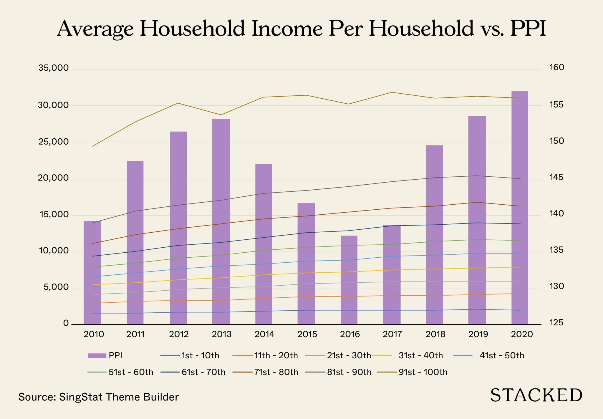
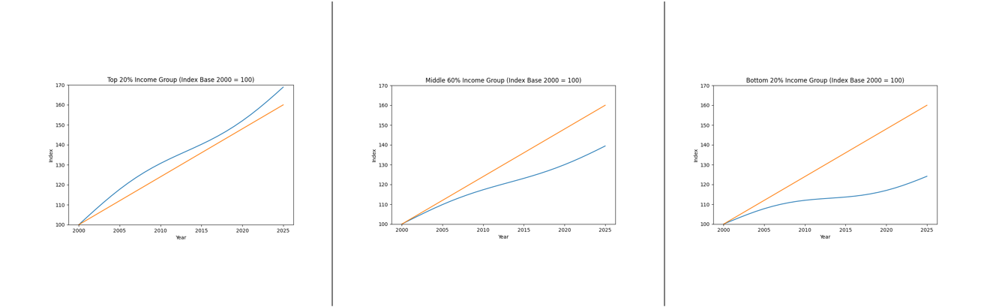
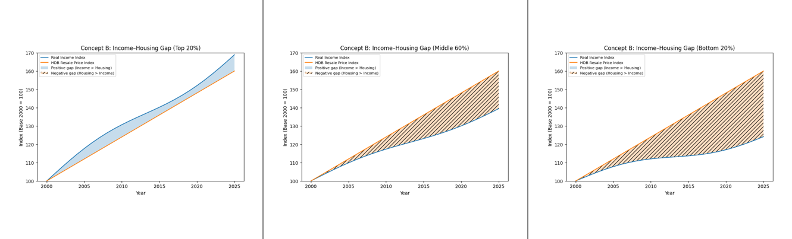
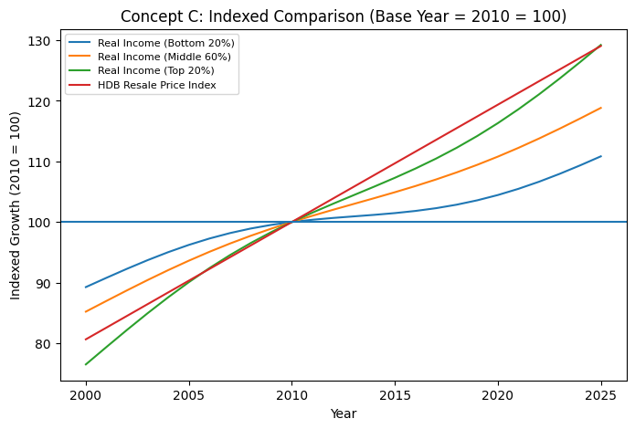

## Chosen Visualization and Story

### Visualization Example (Original)

The original visualization, **“Average Household Income Per Household vs Purchasing Power Index (PPI)”**, combines stacked bar charts representing average household income across income deciles with an overlaid Purchasing Power Index (PPI) line across time. The intention of the visualization is to compare income growth with changes in purchasing power at a national level.

{width=56% fig-align="center"}

### Intended Story / Key Message

While the original visualization compares income with a general purchasing power index, it does not isolate specific cost pressures such as housing. This project refocuses the analysis on housing affordability, as housing represents the largest expenditure component for Singapore households.

The extended time horizon (2000–2025) allows examination of affordability dynamics across multiple economic cycles, including the Global Financial Crisis (2008–2009) and the COVID-19 period.

The refined research question guiding this project is:

**Did real income growth for lower-income households keep pace with housing price growth between 2000 and 2025, and have affordability gaps widened across income groups over time?**

Preliminary inspection suggests a general upward trend across most income deciles between 2000 and the latest available year, with a temporary decline during the COVID-19 period around 2020.

## Strengths and Weaknesses of the Original Visualization

### Strengths

-   Provides a clear high-level comparison between income growth and purchasing power.
-   Time-series structure allows identification of long-term trends and periods of divergence.
-   Familiar and accessible chart design suitable for non-technical audiences.
-   Inclusion of income deciles acknowledges income heterogeneity across households.

### Weaknesses
-  The dual-axis design actively distorts perception by visually aligning independently scaled variables, which can falsely suggest correlation and exaggerate the apparent relationship between income and PPI.
-  Displaying ten income deciles simultaneously creates visual congestion and increases cognitive load, reducing interpretability.
-  The chart presents nominal income values without adjusting for inflation, limiting meaningful purchasing power comparison.
-  There is no explicit affordability metric linking income growth to specific cost pressures such as housing.
-  The aggregated Purchasing Power Index does not reveal distributional affordability differences across income groups.
-  The legend is overly dense, requiring excessive visual cross-referencing and weakening narrative clarity.

## Proposed Improvements and Justifications

The proposed improvements directly address the perceptual distortions, lack of inflation adjustment, and absence of affordability metrics identified in the original visualization.

### Reduce the Number of Income Groups Displayed

Income groups will be aggregated into broader categories (Bottom 20%, Middle 60%, Top 20%) to reduce cognitive load and improve interpretability.

### Improve Comparison Between Income and Prices

The stacked bar chart will be replaced with a faceted line chart to enable clearer comparison of income and housing price trends across income groups.

### Incorporate Purchasing Power (Real Income)

Household income will be deflated using CPI to derive real income series, ensuring inflation-adjusted comparability across time.

### Improve Visual Hierarchy and Narrative

Clear titles, consistent scales, and annotations will be used to guide interpretation and highlight divergence in affordability trends.

## Data Sources

The datasets used in this project are obtained from official Singapore government sources to ensure reliability, consistency, and relevance.

### Household Income by Income Decile

-   **Source**: Department of Statistics Singapore (SingStat)\
-   **Dataset**: Average Monthly Household Income by Income Decile\
-   **URL**: <https://tablebuilder.singstat.gov.sg/table/CT/17880\>
-   **Justification**: This dataset provides a disaggregated view of household income across income deciles, which is essential for analysing distributional differences in affordability outcomes.

### Consumer Price Index (CPI – All Items)

-   **Source**: Department of Statistics Singapore (SingStat)\
-   **URL**: <https://www.singstat.gov.sg/whats-new/latest-news/cpi-highlights\>
-   **Justification**: CPI is used to adjust nominal household income into real terms, allowing purchasing power and affordability trends to be analysed more accurately over time.

### HDB Resale Price Index

-   **Source**: data.gov.sg (Housing & Development Board)\
-   **URL**: <https://data.gov.sg/collections/189/view\>
-   **Justification**: The HDB resale price index is used as a proxy for housing costs, which represent the largest expenditure component for most Singapore households.

### Optional / Contextual Datasets

The following datasets were explored for contextual understanding but are not used in the final visualization:

<!-- - Private Residential Property Price Index – https://data.gov.sg/collections/1676/view   -->
<!-- - Rental Price Indices – https://data.gov.sg/datasets/d_c9f57187485a850908655db0e8cfe651/view   -->
- [Private Residential Property Price Index – data.gov.sg](https://data.gov.sg/collections/1676/view)  
- [Rental Price Indices – data.gov.sg](https://data.gov.sg/datasets/d_c9f57187485a850908655db0e8cfe651/view)

## Data Workflow: Raw to Visualization-Ready

### Raw Data Ingestion

Raw datasets are downloaded from official sources and aligned to a common annual time range (2000–2025), subject to latest available release year.

### Data Cleaning and Standardisation

Data is inspected for missing values and inconsistencies. Time variables and income group labels are standardised, and irrelevant fields are removed.

### Data Transformation and Aggregation

- All monetary values will be adjusted to real 2010 dollars using CPI deflation before index construction.
- Missing years, if any, will be handled via linear interpolation only if gaps are ≤ 1 year; otherwise omitted with justification.
- Nominal income values will be converted into real income terms using CPI (All Items) as a deflator:

**Real Income = Nominal Income ÷ (CPI / CPI_2010)**

**Indexed Value = (Real Income ÷ Real Income_2010) × 100**

Where CPI base year differences exist, rebasing will be performed to ensure consistent index alignment across datasets.

Income and housing price series are converted into normalised indices, rebased to 2010 = 100 for consistent long-term comparison.

### Validation and Quality Checks

Merged datasets are validated to ensure accurate alignment across time and income groups, with checks for duplication or data loss.

### Final Tidy Dataset

The final dataset is reshaped into long format with variables: Year, Income Group, Measure Type, and Index Value, suitable for faceted line chart visualisation.

The resulting dataset contains four primary analytical dimensions:

(1) Year (time dimension),

(2) Income Group (distributional dimension),

(3) Measure Type (Real Income vs Housing Price),

(4) Indexed Value (quantitative measure).

This multidimensional structure enables comparative layering and faceted visualization while maintaining analytical clarity.

## Planned Data Analysis

Descriptive and comparative trend analysis will be conducted to:

- Compare income and housing price growth rates across income groups.
- Identify periods where housing prices outpace income growth.
- Support visual annotations highlighting divergence or convergence trends.

An affordability gap index (Housing Price Index – Real Income Index) will be computed to quantify divergence across income groups over time.

## Limitations

This analysis relies on CPI (All Items) to deflate income, which may not fully capture housing-specific inflation pressures. The HDB resale price index reflects transaction prices but does not account for mortgage interest rates or financing conditions. Household income data represents gross income and does not reflect disposable income after taxes and transfers. Additionally, index rebasing improves comparability of growth rates but obscures absolute level differences across income groups.

## Planned Work Distribution

| Team Member | Responsibilities |
|-----------------------------|-------------------------------------------|
| Shina Shih Xin Rong | Project coordination, narrative development, Quarto assembly |
| Jeanie Cherie Chua Yue-Ning | Data collection and cleaning |
| Claudia Yue Xin Ying | Data transformation and index construction |
| Nurul Zahirah Binte Muhamadnoh | Visualization design and implementation |
| Anushka Chourasia | Data validation and analysis support |

## Appendix: Alternative Design Concepts

The following visual mockups are AI-generated conceptual charts created to illustrate potential visualization structures. These charts do not represent actual project data and are included solely to demonstrate design direction considered during the proposal stage.

### Concept A: Small Multiples Line Chart (By Income Group)

{width=90% fig-align="center"}

This design separates income groups (Bottom 20%, Middle 60%, Top 20%) into individual panels with consistent y-axis scales.

Why considered:
- Reduces visual clutter.
- Eliminates dual-axis distortion.
- Makes within-group divergence clear.

Why not selected as primary design:
- Requires more vertical space.
- Cross-group comparison less immediate.

### Concept B: Income–Housing Gap Area Chart

{width=90% fig-align="center"}

This design shades the difference between real income index and housing price index to highlight affordability gaps.

Why considered:
- Visually emphasises divergence.
- Intuitive for non-technical audiences.

Why not selected:
- Area shading may exaggerate perceived magnitude.
- Less academically neutral in tone.

### Concept C: Indexed Comparison (Base Year = 2010 = 100)

{height=200px fig-align="center"}

Indexed comparison removes nominal scale distortion and eliminates the dual-axis bias present in the original design. By converting income and housing series into normalised indices rebased to 2010 = 100, all variables share a common baseline, enabling direct growth comparison without perceptual manipulation.

Why preferred:
- Standard economic practice.
- Removes scale distortion.
- Clean and professional.
- Supports analytical interpretation.